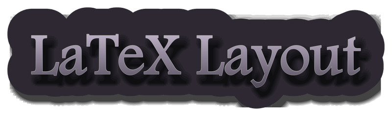

<p align="center">
  
</p>

Ein Baukasten aus LaTeX-Dokumentklassen im Layout von **Das Schwarze Auge 5**, nach den Maßen
des offiziellen *Scriptorium Aventuris – Layout Baukastens* von Ulisses Spiele. Was das Toolset
im Einzelnen kann, steht in der Feature-Liste unten.

**Der Code steht unter Apache 2.0. Die Grafiken und Schriften sind nicht Teil dieses Projekts** und
müssen selbst besorgt werden — siehe [Einrichten und Bauen](doku/EINRICHTUNG.md). Ohne sie
kompiliert nichts.

Die Vorlage ist mit Hilfe einer KI entstanden und dafür gedacht, auch mit einer KI benutzt zu
werden: **LaTeX muss man dafür nicht (vollständig) lernen.** Wie das geht, steht in
[Einrichten und Bauen](doku/EINRICHTUNG.md) unter „Mit einer KI setzen“.

---

## Was das Toolset kann

Jedes Feature ist eine eigene Klasse oder eine eigene Erweiterung, mit eigener Elementreferenz.

| Feature | Klasse | wofür | Doku |
|---|---|---|---|
| Abenteuer setzen | `dsa5latex.cls` | Zweispaltiger Satz auf A4 mit Grundlinienraster, Pergament- und Wertekästen in Produktionsgröße, Kapitelbanner, Meistermasken, Seitenhintergründe, Textumfluss | [Elementreferenz](doku/ELEMENTE.md) |
| Kampfkarten mit Zollraster | — (`beispiel/battlemap.tex`, kein `.cls`) | Eigenes Blatt neben dem Heft (A4 bis A1, hoch oder quer) mit gestricheltem Zollraster über einer Karte, kein eigener Seitentyp der Klasse | [Elementreferenz](doku/ELEMENTE.md#seitentypen) |

Einrichten, Grafiken und Schriften besorgen, bauen — das gilt featureübergreifend und steht in
[Einrichten und Bauen](doku/EINRICHTUNG.md).

---

## Warum keine Grafiken im Projekt

Alles Bildmaterial und beide Schriften gehören Ulisses Spiele beziehungsweise deren Urhebern und
stehen unter der *Vereinbarung über Gemeinschaftsinhalte für SCRIPTORIUM AVENTURIS*. Diese
Vereinbarung ist mit Apache 2.0 nicht vereinbar: Apache erlaubt Weitergabe und Veränderung ohne
Rückfrage, die Scriptorium-Vereinbarung nicht.

Deshalb enthält dieses Repository **ausschließlich eigenes Material**: die Klasse, die
Werkzeuge, die Dokumentation der Maße. `schriften/` ist leer, `grafiken/` bis auf eine
Ausnahme ebenso, und beide sind in `.gitignore` eingetragen. Wer die Klasse benutzt, lädt
das offizielle Paket selbst herunter. Wer im Scriptorium veröffentlichen will, braucht es
sowieso.

Die Ausnahme ist `grafiken/titelbild.jpg`, der Zwerg am Setzkasten. Das Bild ist mit einer KI
erzeugt und gehört diesem Projekt, nicht Ulisses — deshalb darf es hier liegen, und
`\dsaUmschlagVorne` hat nach dem Klonen ein Titelbild, ohne dass man eines suchen muss.

Die Maße in diesem Projekt sind kein Bildmaterial, sondern Messergebnisse. Sie stehen in
`doku/MASSE.md` mit ihrer Herleitung.

---

## Einrichten und Bauen

Grafiken und Schriften besorgen, XeLaTeX aufsetzen, die Beispieldokumente bauen und, wer mag,
auch mit einer KI setzen: **[Einrichten und Bauen](doku/EINRICHTUNG.md)**. Kurzfassung:

```sh
python3 werkzeuge/aufbereiten.py "/pfad/zu/Scriptorium Aventuris v4"
cd beispiel
TEXINPUTS="..;" xelatex beispiel.tex     # dreimal, wegen Inhalt und Marken
```

Die Elementreferenz der Kernklasse steht in `doku/ELEMENTE.md`, dort auch die Kampfkarten mit
Zollraster (`beispiel/battlemap.tex`, Abschnitt „Seitentypen“) — kein eigener Seitentyp der
Klasse, sondern ein eigenes Blatt (A4 bis A1, hoch oder quer) neben dem Heft.

---

## Stand

**Die Klasse läuft.** Alle fünf Beispieldokumente bauen mit XeLaTeX aus TeX Live 2026
fehlerfrei durch, `beispiel.tex` mit 22 Seiten und ohne eine einzige LaTeX-Warnung. Sechs
`Overfull \hbox` sind der gewollte Überhang der Kästen, fünf `Underfull \hbox` sind lockere
Umbrüche im 80,5-mm-Satz. `battlemap.tex` baut alle acht Kombinationen aus Blattformat
(A4 bis A1) und Lage (hoch, quer) ohne Fehlermeldung.

**Und sie ist nachgemessen.** Von den vierzehn Prüfmarken, die der Quelltext einmal trug,
sind zehn erledigt, darunter zwei echte Fehler: der Kapiteltitel stand mit 23,5 statt
31,73 pt (die IDML skaliert ihn auf 135 %), und vor dem Titel stand ein „Kapitel N:“, das
kein gesetzter Band führt. Die vier verbliebenen heißen im Quelltext `% OFFEN:`: sie warten
nicht auf eine Messung, sondern auf eine Quelle, die es nicht gibt. Welche das sind, steht
in `doku/ELEMENTE.md` unter „Was noch nicht nachgemessen ist“, der Stand jeder Messung in
`doku/PRUEFPLAN.md`. Das Zollraster der Kampfkarten ist dort ebenfalls nachgemessen: alle vier
Blattgrößen treffen ihr Sollmaß, der Linienabstand liegt auf 72,001 bp gegen ein Sollmaß von
72 bp.

---

## Woher die Maße kommen

Nicht geschätzt, sondern gemessen, auf drei voneinander unabhängigen Wegen, die sich
gegenseitig bestätigen:

1. Der Klartext des Verlags. Seite 2 des Baukasten-PDF nennt Satzspiegel, Grafikbereich, Raster
   und Anschnitt in Worten. `Scriptorium Aventuris Lies mich zuerst v1.4.pdf` nennt die
   Schriftenhierarchie.
2. Die Pixelmaße der Vorlagengrafiken. Alle sind mit 300 ppi angelegt; Pixel geteilt durch 300,
   mal 25,4 ergibt das Produktionsmaß.
3. Die Rahmenmaße im InDesign-Dokument. `Scriptorium Aventuris v4.idml` ist ein ZIP; darin
   stehen zu jedem platzierten Bild der Rahmen und, entscheidend, `ActualPpi` und `EffectivePpi`.
   Sind beide gleich, liegt das Bild auf 100 % und der Rahmen ist das Produktionsmaß. Von 46
   platzierten Bildern erfüllen 27 das.

Alles einzeln in `doku/MASSE.md`.

---

## Was diese Klasse nicht ist

Sie ist **keine** Fortsetzung von **DSaTeX** von Lukas Ester, der ersten LaTeX-Vorlage für DSA5 im
Scriptorium. Diese Klasse teilt mit ihr keine Zeile Code. Sie ist aber durch sie angeregt, und der
Vergleich mit ihr hat die meisten Maße überhaupt erst hervorgebracht. 24 Abweichungen zwischen
DSaTeX und dem offiziellen Baukasten stehen in `doku/MASSE.md`, weil sie erklären, warum hier
manches anders gelöst ist.

Wer DSaTeX benutzt und sie behalten will, findet dort die Liste der Punkte, die sich lohnen zu
korrigieren. Insbesondere: DSaTeX lädt keine Sprachunterstützung, trennt deutschen Text also nach
englischen Mustern.

---

## Rechtliches

Der Code dieses Projekts steht unter **Apache License 2.0**, siehe `LICENSE` und `NOTICE`.

Die Titelgrafik oben ist keine Ausnahme von der Regel, sondern ihr Ergebnis: sie ist mit
`beispiel/titelgrafik.tex` aus der Klasse gesetzt und zeigt das Titeldesign des Baukastens.
Der Satz gehört diesem Projekt, das Design nicht.

Das gilt **nicht** für das Material, das in `grafiken/` und `schriften/` landet: weder für das aus
dem Baukasten noch für die Karten des Rückseiten-Pakets oder die einzelnen Grafikdateien. Dafür
gilt die *Vereinbarung über Gemeinschaftsinhalte für SCRIPTORIUM AVENTURIS*. Der Baukasten schreibt einen
Wortlaut vor, der in jedem damit gesetzten Werk stehen muss; die Klasse stellt ihn als
`\dsaRechtstext{…}` bereit.

> Das Schwarze Auge und sein Logo sowie Aventuria, Dere, Myranor, Riesland, Tharun, Uthuria, The
> Dark Eye und ihre Logos sind eingetragene Marken von Ulisses Medien und Spiele Distribution GmbH.

Dieses Projekt steht in keiner Verbindung zu Ulisses Spiele und ist nicht von dort autorisiert.
